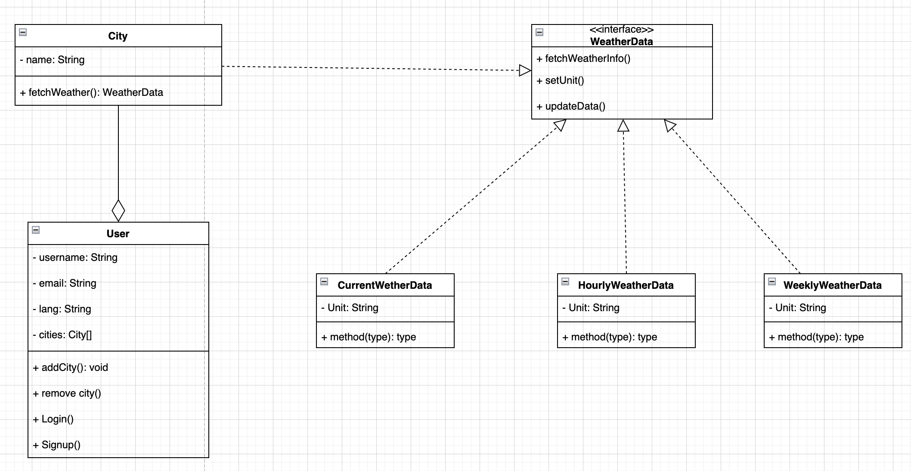
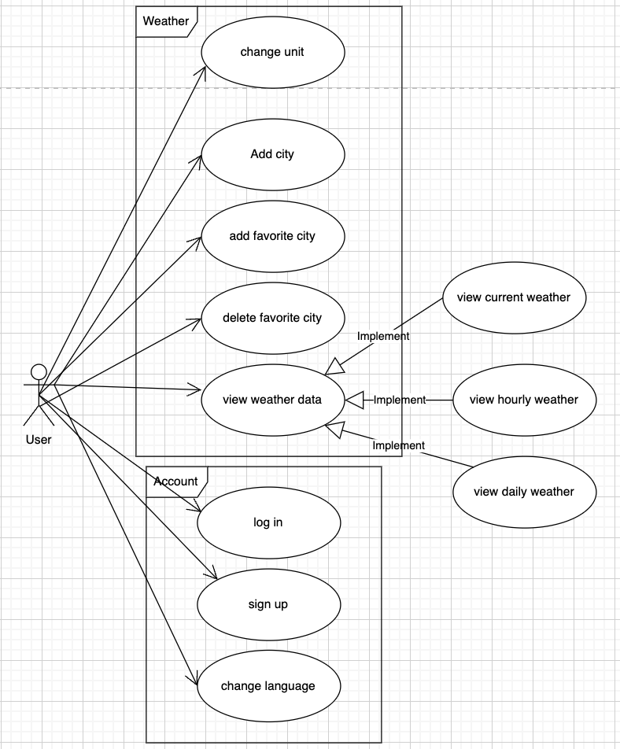
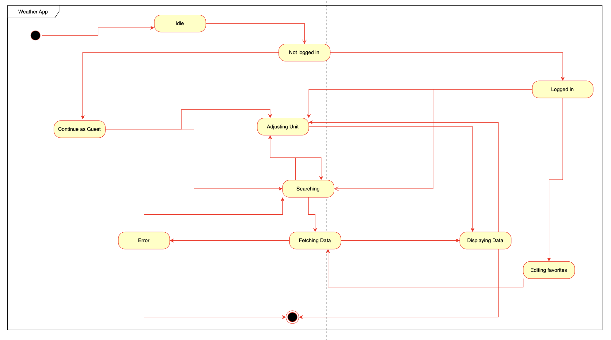
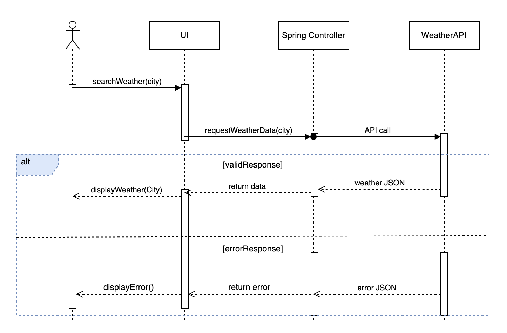

- [UML diagrams](#UML-diagrams)
    - [Class diagram](#Class-diagram)
    - [Use case diagram](#Use-case-diagram)
    - [State diagram](#State-diagram)
    - [Sequence diagram](#Sequence-diagram)

# UML diagrams

## Class diagram

- The class diagram illustrates the architecture of a weather application. The "City" class has a method that retrieves weather data for a specific city. The "User" class contains user-related information such as username, email, language preference, and a list of cities. It also has methods for adding and removing cities, as well as handling login and signup processes. The "WeatherData" interface defines methods for obtaining weather information, setting units, and updating data. Three classes - "CurrentWeatherData," "HourlyWeatherData," and "WeeklyWeatherData" - implement this interface, each holding weather data in different formats and containing a generic method.

## Use case diagram

- The use case diagram illustrates the functionalities of a weather app from a user's perspective. In the context of "Weather," users can perform various actions such as changing the unit of measurement, adding a city, marking a city as a favorite, deleting a favorite city, and viewing different types of weather data, including current, hourly, and daily forecasts. The "User" entity is linked to an "Account" subset, which specifies actions related to managing the user account. Within this account context, users can log in, sign up for a new account, and change their preferred language. The diagram outlines the primary interactions a user can have with the app and the features they can access.

## State diagram

- The state diagram is a visual representation of the various states and transitions within a weather application. Initially, when the app is opened, it is in the "Idle" state. From here, users can either choose to log in, moving the app to the "Logged in" state, or continue as a guest, leading to the "Not logged in" state. In both states, users can search for weather, adjust units, and fetch data. If there is an issue, the app enters an "Error" state. Furthermore, logged-in users have the option to edit their favorite weather locations.

## Sequence diagram

- The sequence diagram illustrates obtaining weather information in a weather app. First, a user initiates a search for weather in a specific city via the UI. Then, the UI requests weather data from the Spring Controller. The Spring Controller makes an API call to the WeatherAPI to retrieve the requested weather data. Depending on the response, the "alt" fragment indicates the alternative sequences that can occur. If the WeatherAPI returns valid weather data, the UI displays the weather details. However, if an error occurs while retrieving the data, the UI displays an error message instead.