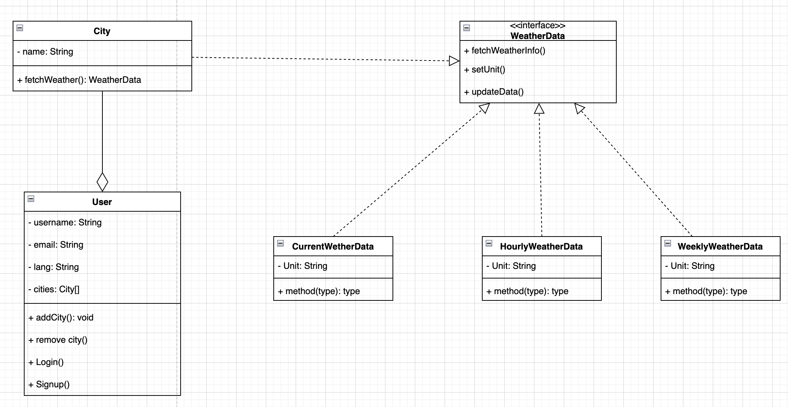

- [UML diagrams](#UML-diagrams)
    - [Class diagram](#Class-diagram)
    - [Use case diagram](#Use-case-diagram)
    - [State diagram](#State-diagram)
    - [Sequence diagram](#Sequence-diagram)

# UML diagrams

## Class diagram

## Use case diagram

## State diagram

## Sequence diagram